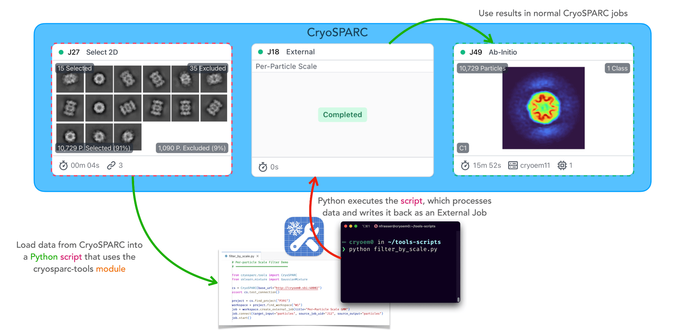

# Getting Started

**cryosparc-tools** is an open-source Python library that enables scripting access to the [CryoSPARC](https://cryosparc.com) <abbr title="Cryogenic-electron microscopy">cryo-EM</abbr> software package.



Use it for the following use cases:

- Programmatically read and write exposure, particle and volume data
- Access project, workspace and job data
- Build and run jobs to orchestrate custom cryo-EM workflows
- Extend CryoSPARC functionality with third-party software packages

```{note}
This guide documents usage of the `cryosparc-tools` Python library. For CryoSPARC installation or general CryoSPARC usage instructions, [read the official guide](https://guide.cryosparc.com).
```

For usage questions and general discussion about `cryosparc-tools` scripts and functions, please post to the [CryoSPARC discussion forum](https://discuss.cryosparc.com/c/scripting) under the Scripting category.

If you like to request or propose a feature, change or fix for `cryosparc-tools` source code, please either [report an issue](https://github.com/cryoem-uoft/cryosparc-tools/issues/new) or [submit a pull request](https://github.com/cryoem-uoft/cryosparc-tools/compare).

Source code is [available on GitHub](https://github.com/cryoem-uoft/cryosparc-tools).

## Pre-requisites

- [Python ≥ 3.7](https://www.python.org/downloads/)
- [CryoSPARC ≥ v4.1](https://cryosparc.com/download)

CryoSPARC installation must be accessible via one of the following methods:

- Running on the local machine
- Running on a machine on the same network with `BASE_PORT + 2`, `BASE_PORT + 3` and `BASE_PORT + 5` open for TCP connections
- Running on a remote machine with `BASE_PORT + 2`, `BASE_PORT + 3` and `BASE_PORT + 5` forwarded to the local machine

See [SSH Port Forwarding](https://guide.cryosparc.com/setup-configuration-and-management/how-to-download-install-and-configure/accessing-cryosparc#ssh-port-forwarding-on-a-nix-system)
documentation for accessing a CryoSPARC instance on a remote machine accessible
via <abbr title="Secure Shell">SSH</abbr>.

cryosparc-tools is only available for CryoSPARC v4.1 or newer. If using CryoSPARC v4.0 or older, please see the [Manipulating .cs Files Created By CryoSPARC](https://guide.cryosparc.com/setup-configuration-and-management/software-system-guides/manipulating-.cs-files-created-by-cryosparc) guide.

### Python Environment

cryosparc-tools is intended to be used in a dedicated Python environment
_outside_ of the CryoSPARC installation. A virtual environment is recommended to
avoid conflicts with global Python installations.

Virtual environment tools such as
[venv](https://docs.python.org/3/tutorial/venv.html),
[Conda](https://docs.conda.io/en/latest/),
[Mamba](https://mamba.readthedocs.io/en/latest/),
[Pipenv](https://pipenv.pypa.io/en/latest/) and
[Poetry](https://python-poetry.org) all work with cryosparc-tools.

Ensure that the virtual environment is based on a supported version of Python
(see Pre-requisites above).

## Installation

Install cryosparc-tools in the command line from [PyPI](https://pypi.org) into
the current Python environment:

```sh
pip install cryosparc-tools
```

Update an existing installation of cryosparc-tools to the latest release:

```sh
pip install -U cryosparc-tools
```

```{note}
Use the version of cryosparc-tools that corresponds to your CryoSPARC _minor_
release version. i.e., if the CryoSPARC version is vX.Y.Z, use the latest vX.Y
tools package. The Z component does not need to match.

For example, if you are running CryoSPARC v4.1.2, install cryosparc-tools with
`pip install cryosparc-tools~=4.1.0` (equivalent to `pip install "cryosparc-tools>=4.1.0,<4.2"`).
If you later update to CryoSPARC v4.2.0 or v5.0.0, re-install the corresponding
tools package with `pip install cryosparc-tools~=4.2.0` or
`pip install cryosparc-tools~=5.0.0` respectively.
```

## Usage

Import from a Python module and connect to a CryoSPARC instance. Include your
CryoSPARC license ID, the network hostname of the machine hosting your CryoSPARC
instance, the instance's base port number and your email/password login
credentials.

```py
from cryosparc.tools import CryoSPARC

cs = CryoSPARC(
    license="xxxxxxxx-xxxx-xxxx-xxxx-xxxxxxxxxxxx",
    host="localhost",
    base_port=39000,
    email="ali@example.com",
    password="password123"
)
```

This assumes CryoSPARC base ports +2, +3 and +5 (e.g., 39002, 39003 and 39005) are
available at `localhost` on the local machine. If CryoSPARC is on another
machine on the same network with a different host, say "hostname", use
`host="hostname"`.

Query projects, jobs and result datasets:

```py
project = cs.find_project("P3")
job = project.find_job("J42")
micrographs = job.load_output("exposures")

for mic in micrographs.rows():
    print(mic["blob/path"])
```

Load and save datasets directly (assumes project directory is available on
current machine):

```py
from cryosparc.dataset import Dataset

path = project.dir() / "J43" / "particles.cs"
particles = Dataset.load(path)

shift_y, shift_x = particles["alignments2D/shift"].T
mic_shape_y, mic_shape_x = particles["location/micrograph_shape"].T
new_loc_x = particles["location/center_x_frac"] * mic_shape_x - shift_x
new_loc_y = particles["location/center_y_frac"] * mic_shape_y - shift_y
particles["location/center_x_frac"] *= new_loc_x / mic_shape_x
particles["location/center_y_frac"] *= new_loc_y / mic_shape_y

particles.save(path)
```

## Running the Examples

The example Jupyter notebooks require additional dependencies to run. Use
[conda](https://www.anaconda.com/products/distribution) to create a new Python
environment with the required dependencies. Here the environment is named
`cryosparc-tools-example` but any name may be substituted:

```sh
conda create -n cryosparc-tools-example -c conda-forge python=3 numpy==1.18.5
conda activate cryosparc-tools-example
pip install matplotlib~=3.4.0 pandas==1.1.4 cryosparc-tools
```

For speed, these do not include the dependencies for the crYOLO example
notebook. Optionally install crYOLO with these commands:

```sh
conda install -c conda-forge pyqt=5 libtiff wxPython=4.1.1 adwaita-icon-theme
pip install nvidia-pyindex
pip install "cryolo[c11]"
```

Install Jupyter with this command:

```sh
pip install notebook
```

Example notebooks ran on Ubuntu Linux with x86-64 bit architecture.

## Next Steps

Browse the included examples real-life use cases for `cryosparc-tools`. Read the
API Reference for full usage capabilities.

```{tableofcontents}

```

## Contributing

[Read the contribution guide](https://github.com/cryoem-uoft/cryosparc-tools/blob/develop/CONTRIBUTING.md) for full details.

If you publish an open-source tool that uses this package to GitHub, add the
`cryosparc-tools` topic to your repository so others may discover it.
[Browse tagged packages here](https://github.com/topics/cryosparc-tools).

## License

cryosparc-tools is licensed under the BSD-3-Clause license.
[View full license text](https://github.com/cryoem-uoft/cryosparc-tools/blob/main/LICENSE).
